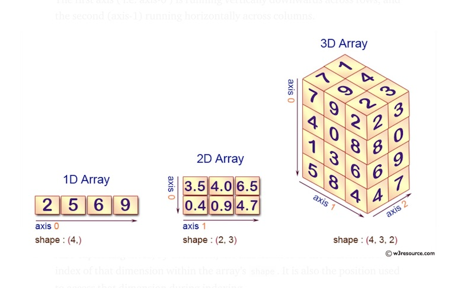

# NumPy, continued.

## Warmup

We left off talking about the advantages of numpy ndarrays, and tonight we will delve into them further. But let's make sure you have the hang of creating a Numpy ndarray. 

Given the following, create a numpy array:

```
temps = [[[34.5, 65.3], [23.4, 65.0], [99.3, 96.3]],  [[23.4, 54.2], [32.4, 34.2], [12.4, 56.4]]]
```

What are its attributes? ndim? shape? size? dtype?

# Subsetting (Indexing) and Slicing

In our previous studies, we discussed **indexing**, or how to access subsets of data or elements of data within arrays. 

And remember, indexing begins with zero, so the location of the first item is [0], NOT [1].

One-dimensional arrays allow us to access innermost items with one set of '[ ]'. This selects an element in a row.

```
>>> banana = np.array([1, 2, 3])
>>> banana[1]
2
```

Two-dimensional arrays require two '[ ][ ]' to select the innermost element. This selects a [row] and a [column].

```
>>> a = np.array([[1, 2, 3],
...               [4, 5, 6],
...               [7, 8, 9]])
>>> a[0][1]
2
```

Using one [ ] with a two-dimensional array will return the first row.

```
>>> a[0]
array([1, 2, 3])
```


Three-dimensional arrays require three: '[ ][ ][ ]'. This selects a [matrix] a [row] and a [column].

What about four-dimensional arrays?

Let's practice with temps, a three-dimensional array.

```
>>> temps = [[[34.5, 65.3], [23.4, 65.0], [99.3, 96.3]],  [[23.4, 54.2], [32.4, 34.2], [12.4, 56.4]]]
>>> np.array(temps)
array([[[34.5, 65.3],
        [23.4, 65. ],
        [99.3, 96.3]],

       [[23.4, 54.2],
        [32.4, 34.2],
        [12.4, 56.4]]])
>>> 
```

Looking at temps, using indices, how would we access 23.4?

What is the value at [0][2][1]?

What is the value at [1][2][0]?

What is the value at [1][2]?

What about [0][0][0]?

How do you select all the elements in temps?

Keep practicing! 


Let's look at **slicing** ndarrays. When you use slicing techniques, you are creating a **view** of the original array. Slicing uses python's [start : stop : step] parameters structure, which you should already be familiar with.

Here is how we can work with a one-dimensional array:


```
>>> apples = np.arange(10)
>>> apples
array([0, 1, 2, 3, 4, 5, 6, 7, 8, 9])

# slice single item
>>> apples[2]
2

# slice items between indexes -- start at 5, stop at 8
>>> apples[5:8]
array([5, 6, 7])

# slice items starting from an index -- include all, starting at 2
>>> apples[2:]
[2  3  4  5  6  7  8  9]

# using negative indices selects items from the end:
>>> apples[-2]
8
```
A two-dimensional array adds complexity. First, examine the methods we used with one-dimensional arrays and apply them to two-dimensional arrays. The ellipsis syntax is used to indicate selecting in full any remaining unspecified dimensions.

```
>>> a = np.array([[1,2,3],[3,4,5],[4,5,6]]) 

# slice items starting from index 1
>>> a[1:]
array([[3, 4, 5],
       [4, 5, 6]])
       
# select first two rows of an array
>>> a[:2]
array([[1, 2, 3],
       [3, 4, 5]])

# select first two rows, select columns starting at [1]
>>> a[:2, 1:]
array([[2, 3],
       [4, 5]])

# select first two rows, 3rd column
>>> a[:2, 2]
array([3, 5])

# using negative indices selects rows from the end
>>> a[:-2, 2]
array([3])

# return all items in second column
>>> a[...,1]
array([2, 4, 5])
>>> 

# return all items in second row
>>> a[1,...]
array([3, 4, 5])

# slice items from column one onwards
>>> a[...,1:]
array([[2, 3],
       [4, 5],
       [5, 6]])
```

You can find an explanation of indexing with top-notch visuals [here](https://www.pythoninformer.com/python-libraries/numpy/index-and-slice/#:~:text=Slicing%20an%20array,accessed%20in%20a%20different%20order.). Let's take a look at how they define axis, matrices, rows, and columns to solidify concepts. 

Generally, we can think of an array as a row of matrices where element (i,j,k) corresponds to the ith matrix, the jth row, and the kth column. So when we ask for whatever_array[:,:,0], we’re requesting “every matrix, every row, column 0”. The request whatever_array[:, 3] we're asking for all rows, column 3.

(Remember, in a 2D array, it is easy to think of axis 0 as rows and axis 1 as columns)




# Copying arrays

The two main functions for duplicating an array are **copy** and **view**.

View (a "shallow" copy) returns a view of the original array and does not have its own data or memory, but uses the original array. Any modifications reflect in both the original and the view. Use the np.view() function to practice. 

```
>>> x3 = np.array([[[1, 2, 3], [4, 5, 6]], [[7, 8, 9], [10, 11, 12]]])
# create a view of x3
>>> xview = x3.view
# change a value in x3
>>> x3[0] = 47
# the change appears in x3
>>> x3
array([[[47, 47, 47],
        [47, 47, 47]],

       [[ 7,  8,  9],
        [10, 11, 12]]])
# the change also shows up in the view
>>> xview
array([[[47, 47, 47],
        [47, 47, 47]],

       [[ 7,  8,  9],
        [10, 11, 12]]])
```

With copy, a replica of the original array (a "deep" copy) is returned and stored at a new location. The copy doesn’t share data or memory with the original array. Any modifications made to the original are not reflected in the copy, and changes to the copy are not reflected in the original.

We can use the np.copy() function, which returns an array copy of the given object.

Consider this 3D array and how we can manipulate it:


```
>>> apples = np.array([[[1, 2, 3], [4, 5, 6]], [[7, 8, 9], [10, 11, 12]]])
>>> oranges = apples.copy()
>>> oranges
array([[[ 1,  2,  3],
        [ 4,  5,  6]],

       [[ 7,  8,  9],
        [10, 11, 12]]])
>>> apples[0][0] = [100, 200, 300]
>>> apples
array([[[100, 200, 300],
        [ 4,  5,  6]],

       [[  7,   8,   9],
        [ 10,  11,  12]]])
>>> oranges
array([[[ 1,  2,  3],
        [ 4,  5,  6]],

       [[ 7,  8,  9],
        [10, 11, 12]]])
>>> 

```
If we make changes, it will not affect the copy.

What happens when we compare apples to oranges? 

```
>>> apples == oranges
array([[[False, False, False],
        [ True,  True,  True]],

       [[ True,  True,  True],
        [ True,  True,  True]]])
>>> 
```
 
Hint: You can copy/view slices. 

# Boolean Indexing

This type of advanced indexing is used when the object we want to extract is the result of a boolean function. 

Hey there, apples greater than 5!

```
>>> apples
array([[[ 1,  2,  3],
        [ 4,  5,  6]],

       [[ 7,  8,  9],
        [10, 11, 12]]])
>>> apples[apples > 5]
array([ 6,  7,  8,  9, 10, 11, 12])
>>> 
```
We can filter out values, such as NaN (Not a Number).

The "~" is used to apply a the inverse of general condition, such as np.isnan(). Items with the NaN value will be filtered out.

```
>>> numbers = np.array([1, np.nan, 3, 4, np.nan])
>>> numbers[~np.isnan(numbers)]
array([1., 3., 4.])
>>> 
```
Or an invented condition of your choosing:

```
>>> numbers
array([ 1., nan,  3.,  4., nan])
>>> cond = numbers == 3
>>> numbers[~cond]
array([ 1., nan,  4., nan])
>>> 
```
The condition was assigned to items == 3, so 3 was filtered from the array. Note, it does not remove the items from the array, but just returns a grouping that can be assigned to a new array if desired.  

```
>>> numbers[~cond]
array([ 1., nan,  4., nan])
>>> numbers
array([ 1., nan,  3.,  4., nan])
>>> no_three = numbers[~cond]
>>> no_three
array([ 1., nan,  4., nan])
>>> 
```
We can negate an array:

```
>>> numbers
array([ 1., nan,  3.,  4., nan])
>>> no_three = np.array(numbers == 3)
>>> no_three
array([False, False,  True, False, False])
>>> ~no_three
array([ True,  True, False,  True,  True])
>>> 
```


Let's look at a general example:

We have the following np.array and want to replace all of the 7's with 0's:

sully = [[7, 7, 2], [7, 4, 7], [1, 4, 7]]

(Sully is my dog. He's a cute pup!)

We want to determine the position of where the 7's are located as boolean values and store that as a variable, so we do the following: 

```
>>> sully = np.array([[7, 7, 2], [7, 4, 7], [1, 4, 7]])
>>> is_seven = sully == 7
>>> print(is_seven)
[[ True  True False]
 [ True False  True]
 [False False  True]]
 ```
Now we have the boolean values captured in its own array. Let's use this array of boolean values to index our original array, identifying which elements are 7, and then setting them equal to 0.
 
 ```
 >>> sully[is_seven]=0
>>> print(sully)
[[0 0 2]
 [0 4 0]
 [1 4 0]]
 ```
 
 We can select rows to match boolean patterns:
 
 # return rows 1 & 2
 
 pattern1 = np.array([True, True, False])
 
 # return row 3
 
 pattern2 = np.array([False, False, True])
 
 ```
>>> pattern1 = np.array([True, True, False])
>>> pattern2 = np.array([False, False, True])
>>> sully[pattern1]
array([[7, 7, 2],
       [7, 4, 7]])
>>> sully[pattern2]
array([[1, 4, 7]])
```
We can also return columns:

Returns column 3

pattern3 = np.array([False, False, True])

```
>>> pattern3 = np.array([False, False, True])
>>> sully[:, pattern3]
array([[2],
       [0],
       [0]])
```
Returns columns 2 and 3

pattern4 = np.array([False, True, True])

```
>>> pattern4 = np.array([False, True, True])
>>> sully[:, pattern4]
array([[0, 2],
       [4, 0],
       [4, 0]])
```
And when we combine the patterns:

```
>>> sully[pattern1, pattern4]
array([0, 0])
>>> sully[pattern2, pattern4]
array([4, 0])
>>> sully[pattern3, pattern4]
array([4, 0])
```
sully[pattern1] is the same is if we had used the row index of [0, 2]. 

```
>>> sully[[0, 2]]
array([[0, 0, 2],
       [1, 4, 0]])
>>> sully[pattern1]
array([[0, 0, 2],
       [0, 4, 0]])
```
sully[pattern1, pattern2] returns the following: 

```
>>> sully[pattern1, pattern2]
array([2, 0])
```

In which True True False (pattern1) selects the first two rows, and then False False True selects the last item in those two rows: 2 and 0. 

And now for a more practical example to harness the power of boolean indexing:

We're going shopping in the produce aisle, and we see fruits and veggies at various unrealistic costs. Let's turn them into arrays. 

```
>>> produce = np.array(["celery", "apple", "lettuce", "banana", "carrot"])
>>> type = np.array(["veg", "fruit", "veg", "fruit", "veg"])
>>> cost = np.array([1, 3, 2, 1, 8])
```
We can use operands to pull out data based on boolean values. 

Fruits and veggies that cost $2:

```
>>> produce[cost == 2]
array(['lettuce'], dtype='<U7')
```
Veggies that cost less than $3

```
>>> produce[(type == "veg") & (cost < 3)]
array(['celery', 'lettuce'], dtype='<U7')
```
Fruits that cost $2

```
>>> produce[(type == "fruit") & (cost == 2)]
array([], dtype='<U7')
```

# Vectorization, or Scalar Operations

A great thing about arrays is that they allow for batch operations to be carried out in a scalar capacity (meaning we can perform an operation on an array and it will be applied to each element of the array without using for loops). Let's try it out:

```
>>> banana = np.array([1, 2, 3], dtype=np.float64)
>>> print(banana)
[1. 2. 3.]
>>> banana * 10
array([10., 20., 30.])
>>> 
```
Notice that multiplying by 10 was carried out on each item in the array. 

More examples of array arithmetic: 

```
>>> banana * banana
array([1., 4., 9.])
>>> banana + banana
array([2., 4., 6.])
>>> banana2 = banana * 2
>>> print(banana2)
[2. 4. 6.]
>>> banana2 > banana
array([ True,  True,  True])
```

# Universal Functions

Numpy has many mathematical functions, as well, called **ufuncs**. These perform element-wise operations on ndarrays. 

They're fairly easy to apply, and once you get the hang of it they all work the same...

[Here is a list of current available Numpy ufuncs](https://numpy.org/doc/stable/reference/ufuncs.html#available-ufuncs)

Here we go!

```
>>> numeros = np.random.randint(10, size=10)
>>> numeros
array([3, 9, 7, 1, 8, 9, 6, 9, 5, 6])
>>> np.sum(numeros)
63
>>> np.sqrt(numeros)
array([1.73205081, 3.        , 2.64575131, 1.        , 2.82842712,
       3.        , 2.44948974, 3.        , 2.23606798, 2.44948974])
```

Here's a reciprocal function. Remember to examine your datatypes so you get the information returned you expect to get. 

```
>>> np.reciprocal(numeros)
array([0, 0, 0, 1, 0, 0, 0, 0, 0, 0])
>>> numeros.dtype
dtype('int64')
>>> numers = np.reciprocal(numeros.astype('float64'))
>>> numers
array([0.33333333, 0.11111111, 0.14285714, 1.        , 0.125     ,
       0.11111111, 0.16666667, 0.11111111, 0.2       , 0.16666667])
>>> 
```
As you can see, it is as easy as passing the array into the function to perform a mathematical operation:

```
>>> np.max(numeros)
9
>>> np.min(numeros)
1
>>> np.average(numeros)
6.3
```

Calculate a row or colum sum:

```
>>> sully
array([[0, 0, 2],
       [0, 4, 0],
       [1, 4, 0]])
#all sum
>>> np.sum(sully)
11
#row sum
>>> np.sum(sully, axis = 1)
array([2, 4, 5])
#column sum
>>> np.sum(sully, axis = 0)
array([1, 8, 2])
#retain the 2D dimension of sully
>>> np.sum(sully, axis = 1, keepdims = True)
array([[2],
       [4],
       [5]])
```


Evaluating arrays of different sizes is called *broadcasting* and will be discussed later. 


