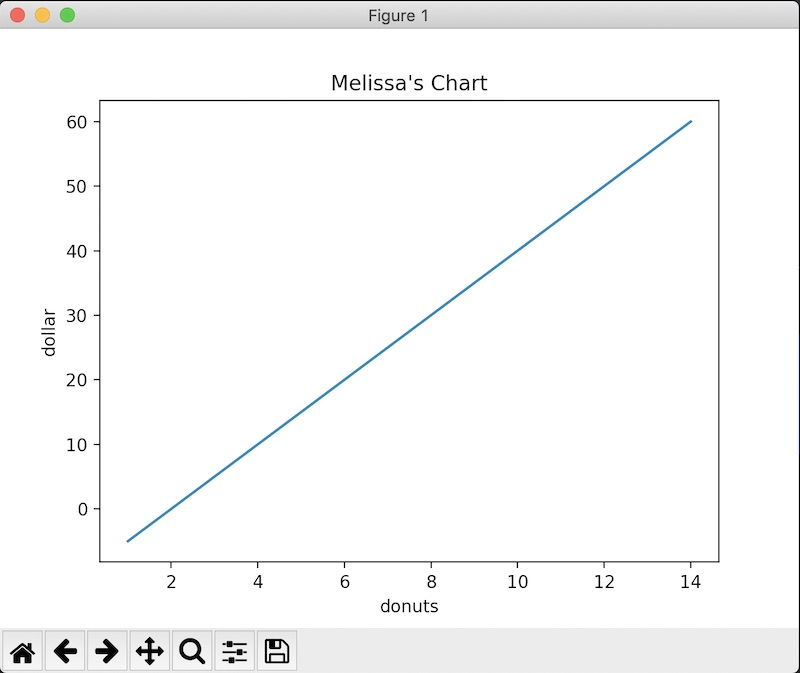

# Last night of NumPy

We've covered a lot of information, but tonight we'll keep it short to review any concepts or homework you have questions on and then tackle a larger problem as a group. 

## MatPlotLib - Visualizing data with NumPy

Instructions for installation are [here](https://matplotlib.org/3.3.3/users/installing.html).

MatPlotLib is a library that lets us create visualizations from NumPy arrays. We can use it to make [all kinds of pretty charts and graphs](https://matplotlib.org/3.3.3/gallery/index.html).

Let's do a quick MatPlotLib tutorial. Import pyplot from matplotlib and call it 'plt'. 

```
# Standard imports, per usual
import matplotlib.pyplot as plt
import numpy as np
```

```
# make a silly array
>>> x = np.arange(1, 15)
# for our demo, y can be anything (in this case, we will end up with a straight line)
>>> y = (x - 2) * 5
# give the chart a title
>>> plt.title("Melissa's Chart")
Text(0.5, 1.0, "Melissa's Chart")
# label our x and y axis
>>> plt.xlabel("donuts")
Text(0.5, 0, 'donuts')
>>> plt.ylabel("dollar")
Text(0, 0.5, 'dollar')
# tell it to plot
>>> plt.plot(x, y)
[<matplotlib.lines.Line2D object at 0x1270fc1c0>]
# tell it to display
>>> plt.show()
```

You should end up with something similar to this: 


