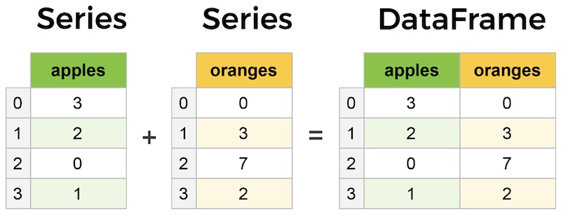
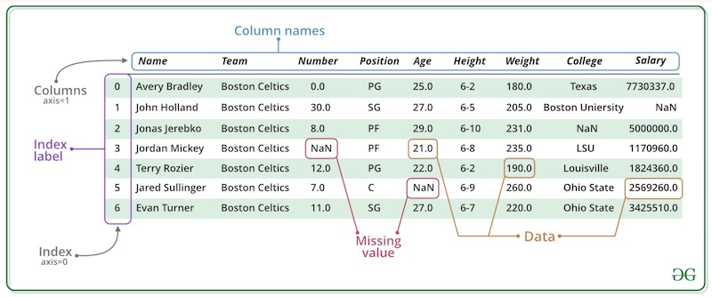

# pandas


We're switching gears a bit; NumPy taught us how to do math with ndarrays of single-type data (homogenous) efficiently, and next on our agenda is **pandas**. Pandas is another library for Python and is built on top of NumPy. Pandas is better suited for data of heterogenous types, and data in tables, or **dataframes**, as they call them in pandas. 

Remember MatPlotLib? Well, pandas provides **wrappers** around the matplotlib library, reducing the lines of code needed to use matploblib code. You may recall from your lesson on object-oriented programming the concept of **abstraction**, which aims to hide the bits that aren't needed, effectively reducing the complexity and therefore the lines of code. Well, that's what a wrapper does. You don't need to know how your coffee pot works, but that you can get some hot bean juice if you do x, y, and z steps. A wrapper is like the buttons on the coffee pot. 

Why is it called pandas? I don't mean to de-mystify it, and you can continue to picture in your mind cute little pandas typing away inside your computer, but it comes from *panel data*, an econometrics term you don't hear a lot and is the term for multidimensional structured datasets. (Please stop trying to insert bamboo into your floppy disk drive.)

Pandas has a wide range of capabilities beyond NumPy, especially when it comes to data structures and data manipulations needed to clean and analyze our data, but we'll still be using NumPy here and there. 

Instructions for installation can be found [here](https://pandas.pydata.org/pandas-docs/stable/getting_started/install.html).

And then we start by naming our imports:

```
>>> import pandas as pd
>>> from pandas import Series, DataFrame
```
Whenever you see pd, we are referring to the pandas library. I also imported Series and Dataframe into the local namespace because they are frequently used, and now I can call them directly without typing pd.Series:

```
>>> my_obj = Series([4, 7, -2, -7])
>>> my_obj
0    4
1    7
2   -2
3   -7
dtype: int64
>>> my_obj = pd.Series([2, 5, 8, 3])
>>> my_obj
0    2
1    5
2    8
3    3
dtype: int64
```
Feel free to do whatever you prefer after you are comfortable with direct imports like this.

## pandas Data Structures Part I: Series and Index

What we created above is a **series**, which is a 1D array-like object, similar to a NumPy 1D array, but has an associated array of index labels. The panda Series is for arrays of data of a single type, and can be thought of a column of a spreadsheet. 

The most basic build of a series looks like this:

``` 
>>> s = pd.Series(data, index=index)
```
And "data" can be a Python dictionary, an ndarray, or even a scalar value. We can provide attributes such as name, dtype, shape, index, and values when we create a panda Series.


Here we have a panda series, with the index labels on the left and the data on the right:

```
>>> my_obj = pd.Series([2, 5, 8, 3, 1, 0])
>>> print(my_obj)
0    2
1    5
2    8
3    3
4    1
5    0
dtype: int64
```
Here is one made from a NumPy array: 

```
>>> import numpy as np
>>> np_series = pd.Series(np.random.randn(5))
>>> np_series
0    2.518028
1    1.018381
2   -0.488189
3   -0.249349
4   -0.166437
dtype: float64
```
Here is a series from a python dictionary:

```
>>> dict = {"r": 2, "d": 2, "c": 3, "p": 0}
>>> dict_series = pd.Series(dict)
>>> dict_series
r    2
d    2
c    3
p    0
dtype: int64
```

The default index label starts at 0, and goes up to "length - 1", but we can specify the label (should we choose) by supplying "index = ". Note: A supplied index must be the same length as the data. 
 
```
 >>> labeled_obj = pd.Series([4, 6, -1, -2], index = ['m', 'e', 't', 'q'])
>>> print(labeled_obj)
m    4
e    6
t   -1
q   -2
dtype: int64
```
When we create a series from a scalar value, the value repeats to the size of the provided index. 

```
# default is one value with one index
>>> pd.Series(5)
0    5
dtype: int64
# we can specify a range to determine the length of the series values
>>> pd.Series(5, index = range(5))
0    5
1    5
2    5
3    5
4    5
dtype: int64
>>> 
# we can define our index
>>> pd.Series(5, index=["a", "b", "c", "d", "e"])
a    5
b    5
c    5
d    5
e    5
dtype: int64
```
With any series, no matter the origin, if we don't like the default index labels, we can change them:

```
>>> s_street = pd.Series(5, index = range(5))
>>> s_street
0    5
1    5
2    5
3    5
4    5
dtype: int64
>>> s_street.index = ['Elmo', 'Cookie Monster', 'Big Bird', 'Oscar', 'Snuffy']
>>> s_street
Elmo              5
Cookie Monster    5
Big Bird          5
Oscar             5
Snuffy            5
dtype: int64
```

We can call the **index** and **values** attributes of each array object we created with methods of corresponding names (as well as many others you are already familiar with: ndim, size, shape, and many you haven't seen). A full list is [here in the documentation](https://pandas.pydata.org/pandas-docs/stable/reference/series.html). Give some a try to get practice:

```
>>> my_obj = pd.Series([2, 5, 8, 3, 1, 0])
>>> my_obj.values
array([2, 5, 8, 3, 1, 0])
>>> my_obj.index
RangeIndex(start=0, stop=6, step=1)

>>> labeled_obj = pd.Series([4, 6, -1, -2], index = ['m', 'e', 't', 'q'])
>>> labeled_obj.values
array([ 4,  6, -1, -2])
>>> labeled_obj.index
Index(['m', 'e', 't', 'q'], dtype='object')
>>> 
```

A clever way to retrieve the values of the index object:

```
>>> my_obj_index = my_obj.index
>>> my_obj_index
RangeIndex(start=0, stop=6, step=1)
>>> my_obj_index.values
array([0, 1, 2, 3, 4, 5])
```
Or we can stack the method calls without assigning the index to a variable (create index object, then call the method on the index object all in one line!):

```
>>> my_obj.index.values
array([0, 1, 2, 3, 4, 5])
```

We can give the Series object and its index object names: 

```
>>> my_obj = pd.Series([2, 5, 8, 3, 1, 0])
>>> my_obj.name = 'MY FIRST PANDA OBJECT!!'
>>> my_obj.index.name = 'PANDA!!'
>>> my_obj
PANDA!!
0    2
1    5
2    8
3    3
4    1
5    0
Name: MY FIRST PANDA OBJECT!!, dtype: int64
>>> 
```

We can check the name, dtype, shape, ndim, size, and uniqueness of index objects as well. [Here is a full list](https://pandas.pydata.org/pandas-docs/stable/reference/indexing.html).

```
>>> my_obj_index.dtype
dtype('int64')
>>> my_obj_index.shape
(6,)
>>> my_obj_index.is_unique
True
>>> my_obj_index.ndim
1
>>> my_obj_index.size
6
# OR by calling methods on the index objects
>>> my_obj.index.shape
(6,)
>>> my_obj.index.size
6
# etc.
```

And just as with NumPy, we can select single values (or a set of values) from the series with indexing:

```
>>> labeled_obj
m    4
e    6
t   -1
q   -2
dtype: int64
>>> labeled_obj['q']
-2
>>> labeled_obj[['q', 'm']]
q   -2
m    4
dtype: int64
>>> labeled_obj[[1, 3]]
e    6
q   -2
dtype: int64
>>> labeled_obj[labeled_obj < 2]
t   -1
q   -2
dtype: int64
>>> labeled_obj[1:2]
e    6
dtype: int64
>>> labeled_obj['e':'q']
e    6
t   -1
q   -2
dtype: int64
>>> my_obj
0    2
1    5
2    8
3    3
4    1
5    0
dtype: int64
>>> my_obj[3]
3
>>> my_obj[[3, 0, 1]]
3    3
0    2
1    5
dtype: int64
```
Returning NaN: If we are building a series object from a dictionary, as we did earlier, the resulting series will place the keys in the original order. However, we can play with it. We can rearrange the order to how we want it to display. Notice below that if we put a key in the index that has no value in the dictionary, we get "NaN". 

```
>>> dict = {"r": 2, "d": 2, "c": 3, "p": 0}
>>> dict_series = pd.Series(dict)
>>> dict_series
r    2
d    2
c    3
p    0
dtype: int64
>>> bots = ['r', 'y', 'c', 'p']
>>> new_series = pd.Series(dict, index = bots)
>>> new_series
r    2.0
y    NaN
c    3.0
p    0.0
dtype: float64 
>>> bots = ['r', 'y', 'p', 'c']
>>> new_series = pd.Series(dict, index = bots)
>>> new_series
r    2.0
y    NaN
p    0.0
c    3.0
dtype: float64
```

The panda functions **isnull** and **notnull** are used to detect missing data:

```
>>> pd.isnull(new_series)
r    False
y     True
p    False
c    False
dtype: bool
>>> pd.notnull(new_series)
r     True
y    False
p     True
c     True
dtype: bool
# using instance methods
>>> new_series.isnull()
r    False
y     True
p    False
c    False
dtype: bool
>>> new_series.notnull()
r     True
y    False
p     True
c     True
dtype: bool
```

We can perform mathematical operations, scalar operations, NumPy functions, etc. and the series will preserve the index-value relationship:

```
>>> dict_series * 2
r    4
d    4
c    6
p    0
dtype: int64
>>> dict_series > 1
r     True
d     True
c     True
p    False
dtype: bool
>>> dict_series[dict_series > 1]
r    2
d    2
c    3
dtype: int64
>>> np.mod(dict_series, 2)
r    0
d    0
c    1
p    0
dtype: int64
>>> 
```
When we perform operations on Series with misaligned indexes, the resulting Series will have an index label aligned by arithmetic operations. This is similar to a 'join' function used in databases (think SQL). Check out the outcome of the index labels of the following:
 
```
>>> dict_series
r    2
d    2
c    3
p    0
dtype: int64
>>> new_series
r    2.0
y    NaN
c    3.0
p    0.0
dtype: float64
>>> dict_series + new_series
c    6.0
d    NaN
p    0.0
r    4.0
y    NaN
dtype: float64
>>> 
```

## pandas Data Structures Part II: DataFrame

Not to blow your minds or anything, but a DataFrame is basically representation of a table or spreadsheet. Each column can be a Series of varying origins. DataFrames have a row index (axis = 0) and column index (axis = 1). Here are some basic examples to help you visualize what we will be creating and working with: 






In the above example, think about the NaN values could have came about. 

Let's create an empty DataFrame: 

```
>>> df1 = pd.DataFrame()
>>> df1
Empty DataFrame
Columns: []
Index: []
```

Any Series can be a DataFrame on its own: 

```
>>> my_obj
PANDA!!
0    2
1    5
2    8
3    3
4    1
5    0
Name: MY FIRST PANDA OBJECT!!, dtype: int64
>>> df = pd.DataFrame(my_obj)
>>> df
                MY FIRST PANDA OBJECT!!
PANDA!!                         
0                                     2
1                                     5
2                                     8
3                                     3
4                                     1
5                                     0
>>> 
```
What do you notice that is different between the Series and the DataFrame made of one Series? (Hint: Is there a name/title? Spacing?)

Or we can transform the Series to a DataFrame with .to_frame()

```
>>> my_obj
PANDA!!
0    2
1    5
2    8
3    3
4    1
5    0
Name: MY FIRST PANDA OBJECT!!, dtype: int64
>>> my_obj.to_frame()
                MY FIRST PANDA OBJECT!!
PANDA!!                         
0                                     2
1                                     5
2                                     8
3                                     3
4                                     1
5                                     0
>>> 
```

A multi-Series DataFrame can easily be created by a dictionary of equal-length lists or NumPy arrays. This will produce a DataFrame with an automatically assigned index and columns placed in sorted order. 

```
>>> data = {'student':['Jane', 'Delilah', 'Kyle', 'Sam', 'Elaine', 'Arthur', 'Thomas'], 'grade':[97, 56, 76, 85, 99, 100, 98], 'age':[13, 13, 13, 13, 13, 14, 13]}
>>> df = pd.DataFrame(data)
>>> df
   student  grade  age
0     Jane     97   13
1  Delilah     56   13
2     Kyle     76   13
3      Sam     85   13
4   Elaine     99   13
5   Arthur    100   14
6   Thomas     98   13
>>> 
```
We can create a DataFrame from a nested dict of dicts, where the outer data is the columns and the inner data as the rows:

```
>>> dict_data = {'St. Louis': {2020: 3.4, 2021: 3.2}, 'Kansas City': {2020: 2.3, 2021: 2.3}}
>>> dict_df = pd.DataFrame(dict_data)
>>> dict_df
      St. Louis  Kansas City
2020        3.4          2.3
2021        3.2          2.3
>>> 
```

Practice: Build a DataFrame on your own, giving it at least 10 rows of data.

Of course, we can specify the column order: 

```
>>> df2 = pd.DataFrame(data, columns=['grade', 'age', 'student'])
>>> df2
   grade  age  student
0     97   13     Jane
1     56   13  Delilah
2     76   13     Kyle
3     85   13      Sam
4     99   13   Elaine
5    100   14   Arthur
6     98   13   Thomas
>>> 
```
Watch what happens when we pass a column that isn't in the original data dictionary:

```
>>> data
{'student': ['Jane', 'Delilah', 'Kyle', 'Sam', 'Elaine', 'Arthur', 'Thomas'], 'grade': [97, 56, 76, 85, 99, 100, 98], 'age': [13, 13, 13, 13, 13, 14, 13]}
>>> df3 = pd.DataFrame(data, columns=['grade', 'age', 'student', 'height'])
>>> df3
   grade  age  student height
0     97   13     Jane    NaN
1     56   13  Delilah    NaN
2     76   13     Kyle    NaN
3     85   13      Sam    NaN
4     99   13   Elaine    NaN
5    100   14   Arthur    NaN
6     98   13   Thomas    NaN
>>> 
```
We just added a column! No data was provided for "height", so the values will appear to be missing. 

We can call the columns attribute of the DataFrames, just in case we forget what columns exist. Pretty handy for larger DataFrames!:

```
>>> df.columns
Index(['student', 'grade', 'age'], dtype='object')
>>> df2.columns
Index(['grade', 'age', 'student'], dtype='object')
>>> df3.columns
Index(['grade', 'age', 'student', 'height'], dtype='object')
>>> 
```

We can retrieve a Series from a DataFrame either by dictionary notation or by column-named attribute: 

```
>>> df['age']
0    13
1    13
2    13
3    13
4    13
5    14
6    13
Name: age, dtype: int64
>>> df.age
0    13
1    13
2    13
3    13
4    13
5    14
6    13
Name: age, dtype: int64
>>> 
```

We can use the index objects to return the contents of rows at a location:

```
>>> df
   student  grade  age
0     Jane     97   13
1  Delilah     56   13
2     Kyle     76   13
3      Sam     85   13
4   Elaine     99   13
5   Arthur    100   14
6   Thomas     98   13
>>> df.loc[4]
student    Elaine
grade          99
age            13
Name: 4, dtype: object
>>> 
```
To demonstrate with index object with specified names:
 

```
>>> data
{'student': ['Jane', 'Delilah', 'Kyle', 'Sam', 'Elaine', 'Arthur', 'Thomas'], 'grade': [97, 56, 76, 85, 99, 100, 98], 'age': [13, 13, 13, 13, 13, 14, 13]}
>>> df = pd.DataFrame(data, index = ['red', 'orange', 'yellow', 'green', 'blue', 'indigo', 'violet'])
>>> df
        student  grade  age
red        Jane     97   13
orange  Delilah     56   13
yellow     Kyle     76   13
green       Sam     85   13
blue     Elaine     99   13
indigo   Arthur    100   14
violet   Thomas     98   13
>>> df.loc['blue']
student    Elaine
grade          99
age            13
Name: blue, dtype: object
>>> 
```

Remember our DataFrame with NaN for "height"? We can assign values, either scalar or with an array (Note, values length must match the DataFrame length.):

```
>>> df3
   grade  age  student height
0     97   13     Jane    NaN
1     56   13  Delilah    NaN
2     76   13     Kyle    NaN
3     85   13      Sam    NaN
4     99   13   Elaine    NaN
5    100   14   Arthur    NaN
6     98   13   Thomas    NaN
>>> df3['height'] = 60
>>> df3
   grade  age  student  height
0     97   13     Jane      60
1     56   13  Delilah      60
2     76   13     Kyle      60
3     85   13      Sam      60
4     99   13   Elaine      60
5    100   14   Arthur      60
6     98   13   Thomas      60
>>> df3['height'] = (60, 55, 60, 55, 60, 55, 60)
>>> df3
   grade  age  student  height
0     97   13     Jane      60
1     56   13  Delilah      55
2     76   13     Kyle      60
3     85   13      Sam      55
4     99   13   Elaine      60
5    100   14   Arthur      55
6     98   13   Thomas      60
>>> df3['height'] = np.arange(56, 63, 1)
>>> df3
   grade  age  student  height
0     97   13     Jane      56
1     56   13  Delilah      57
2     76   13     Kyle      58
3     85   13      Sam      59
4     99   13   Elaine      60
5    100   14   Arthur      61
6     98   13   Thomas      62
>>> 
```
We can also assign values with a Series. Take note, if the length of the Series does not match the length of the DataFrame, or no values are provided for an index, NaN will be inserted into any index value left blank:

```
>>> new_height = pd.Series([70, 71, 72], index = [1, 4, 6])
>>> df3['height'] = new_height
>>> df3
   grade  age  student  height
0     97   13     Jane     NaN
1     56   13  Delilah    70.0
2     76   13     Kyle     NaN
3     85   13      Sam     NaN
4     99   13   Elaine    71.0
5    100   14   Arthur     NaN
6     98   13   Thomas    72.0
```
Let's reexamine our df3 and document with a new column, with boolean values, whether a student is considered tall or not:

```
>>> df3
   grade  age  student  height
0     97   13     Jane      56
1     56   13  Delilah      57
2     76   13     Kyle      58
3     85   13      Sam      59
4     99   13   Elaine      60
5    100   14   Arthur      61
6     98   13   Thomas      62
>>> df3['tall'] = df3.height >= 60
>>> df3
   grade  age  student  height   tall
0     97   13     Jane      56  False
1     56   13  Delilah      57  False
2     76   13     Kyle      58  False
3     85   13      Sam      59  False
4     99   13   Elaine      60   True
5    100   14   Arthur      61   True
6     98   13   Thomas      62   True
>>> 
```
The column "tall" was added, containing boolean values for rows that have a height >=60. 

That kind of pokes fun at the short kids, so let's delete the column "tall":

```
>>> del df3['tall']
>>> df3
   grade  age  student  height
0     97   13     Jane      56
1     56   13  Delilah      57
2     76   13     Kyle      58
3     85   13      Sam      59
4     99   13   Elaine      60
5    100   14   Arthur      61
6     98   13   Thomas      62
>>> 
```
Be careful; deleting a column isn't something you would want to do accidentally.


