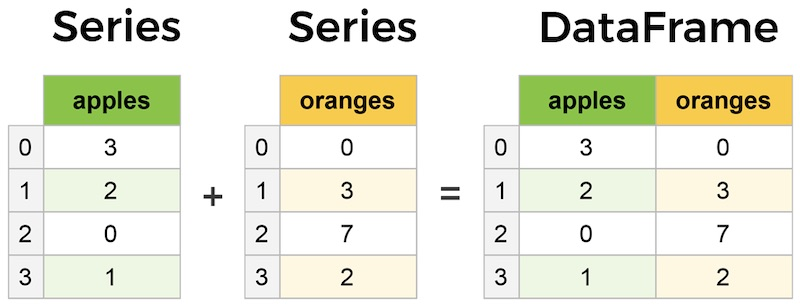
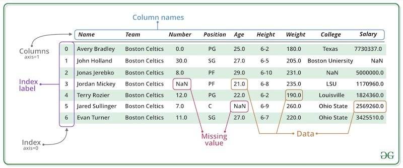

## pandas Data Structures Part II: DataFrame

Not to blow your minds or anything, but a DataFrame is basically representation of a table or spreadsheet. Each column can be a Series of varying origins. DataFrames have a row index (axis = 0) and column index (axis = 1). Here are some basic examples to help you visualize what we will be creating and working with: 






In the above example, think about the NaN values could have came about. 

Let's create an empty DataFrame: 

```
>>> df1 = pd.DataFrame()
>>> df1
Empty DataFrame
Columns: []
Index: []
```

Any Series can be a DataFrame on its own: 

```
>>> my_obj = pd.Series([2, 5, 8, 3, 1, 0], name='MY FIRST PANDA OBJECT!!')
>>> my_obj.index.name = 'PANDA!!'
>>> my_obj
PANDA!!
0    2
1    5
2    8
3    3
4    1
5    0
Name: MY FIRST PANDA OBJECT!!, dtype: int64
>>> df = pd.DataFrame(my_obj)
>>> df
                MY FIRST PANDA OBJECT!!
PANDA!!                         
0                                     2
1                                     5
2                                     8
3                                     3
4                                     1
5                                     0
>>> 
```
What do you notice that is different between the Series and the DataFrame made of one Series? (Hint: Is there a name/title? Spacing?)

Or we can transform the Series to a DataFrame with .to_frame()

```
>>> my_obj
PANDA!!
0    2
1    5
2    8
3    3
4    1
5    0
Name: MY FIRST PANDA OBJECT!!, dtype: int64
>>> my_obj.to_frame()
                MY FIRST PANDA OBJECT!!
PANDA!!                         
0                                     2
1                                     5
2                                     8
3                                     3
4                                     1
5                                     0
>>> 
```

A multi-Series DataFrame can easily be created by a dictionary of equal-length lists or NumPy arrays. This will produce a DataFrame with an automatically assigned index and columns placed in sorted order. 

```
>>> data = {'student':['Jane', 'Delilah', 'Kyle', 'Sam', 'Elaine', 'Arthur', 'Thomas'], 'grade':[97, 56, 76, 85, 99, 100, 98], 'age':[13, 13, 13, 13, 13, 14, 13]}
>>> df = pd.DataFrame(data)
>>> df
   student  grade  age
0     Jane     97   13
1  Delilah     56   13
2     Kyle     76   13
3      Sam     85   13
4   Elaine     99   13
5   Arthur    100   14
6   Thomas     98   13
>>> 
```
We can create a DataFrame from a nested dict of dicts, where the outer data is the columns and the inner data as the rows:

```
>>> dict_data = {'St. Louis': {2020: 3.4, 2021: 3.2}, 'Kansas City': {2020: 2.3, 2021: 2.3}}
>>> dict_df = pd.DataFrame(dict_data)
>>> dict_df
      St. Louis  Kansas City
2020        3.4          2.3
2021        3.2          2.3
>>> 
```

Practice: Build a DataFrame on your own, giving it at least 10 rows of data.

Of course, we can specify the column order: 

```
>>> df2 = pd.DataFrame(data, columns=['grade', 'age', 'student'])
>>> df2
   grade  age  student
0     97   13     Jane
1     56   13  Delilah
2     76   13     Kyle
3     85   13      Sam
4     99   13   Elaine
5    100   14   Arthur
6     98   13   Thomas
>>> 
```
Watch what happens when we pass a column that isn't in the original data dictionary:

```
>>> data
{'student': ['Jane', 'Delilah', 'Kyle', 'Sam', 'Elaine', 'Arthur', 'Thomas'], 'grade': [97, 56, 76, 85, 99, 100, 98], 'age': [13, 13, 13, 13, 13, 14, 13]}
>>> df3 = pd.DataFrame(data, columns=['grade', 'age', 'student', 'height'])
>>> df3
   grade  age  student height
0     97   13     Jane    NaN
1     56   13  Delilah    NaN
2     76   13     Kyle    NaN
3     85   13      Sam    NaN
4     99   13   Elaine    NaN
5    100   14   Arthur    NaN
6     98   13   Thomas    NaN
>>> 
```
We just added a column! No data was provided for "height", so the values will appear to be missing. 

We can call the columns attribute of the DataFrames, just in case we forget what columns exist. Pretty handy for larger DataFrames!:

```
>>> df.columns
Index(['student', 'grade', 'age'], dtype='object')
>>> df2.columns
Index(['grade', 'age', 'student'], dtype='object')
>>> df3.columns
Index(['grade', 'age', 'student', 'height'], dtype='object')
>>> 
```

We can retrieve a Series from a DataFrame either by dictionary notation or by column-named attribute: 

```
>>> df['age']
0    13
1    13
2    13
3    13
4    13
5    14
6    13
Name: age, dtype: int64
>>> df.age
0    13
1    13
2    13
3    13
4    13
5    14
6    13
Name: age, dtype: int64
>>> 
```

We can use the index objects to return the contents of rows at a location:

```
>>> df
   student  grade  age
0     Jane     97   13
1  Delilah     56   13
2     Kyle     76   13
3      Sam     85   13
4   Elaine     99   13
5   Arthur    100   14
6   Thomas     98   13
>>> df.loc[4]
student    Elaine
grade          99
age            13
Name: 4, dtype: object
>>> 
```
To demonstrate with index object with specified names:
 

```
>>> data
{'student': ['Jane', 'Delilah', 'Kyle', 'Sam', 'Elaine', 'Arthur', 'Thomas'], 'grade': [97, 56, 76, 85, 99, 100, 98], 'age': [13, 13, 13, 13, 13, 14, 13]}
>>> df = pd.DataFrame(data, index = ['red', 'orange', 'yellow', 'green', 'blue', 'indigo', 'violet'])
>>> df
        student  grade  age
red        Jane     97   13
orange  Delilah     56   13
yellow     Kyle     76   13
green       Sam     85   13
blue     Elaine     99   13
indigo   Arthur    100   14
violet   Thomas     98   13
>>> df.loc['blue']
student    Elaine
grade          99
age            13
Name: blue, dtype: object
>>> 
```

Remember our DataFrame with NaN for "height"? We can assign values, either scalar or with an array (Note, values length must match the DataFrame length.):

```
>>> df3
   grade  age  student height
0     97   13     Jane    NaN
1     56   13  Delilah    NaN
2     76   13     Kyle    NaN
3     85   13      Sam    NaN
4     99   13   Elaine    NaN
5    100   14   Arthur    NaN
6     98   13   Thomas    NaN
>>> df3['height'] = 60
>>> df3
   grade  age  student  height
0     97   13     Jane      60
1     56   13  Delilah      60
2     76   13     Kyle      60
3     85   13      Sam      60
4     99   13   Elaine      60
5    100   14   Arthur      60
6     98   13   Thomas      60
>>> df3['height'] = (60, 55, 60, 55, 60, 55, 60)
>>> df3
   grade  age  student  height
0     97   13     Jane      60
1     56   13  Delilah      55
2     76   13     Kyle      60
3     85   13      Sam      55
4     99   13   Elaine      60
5    100   14   Arthur      55
6     98   13   Thomas      60
>>> df3['height'] = np.arange(56, 63, 1)
>>> df3
   grade  age  student  height
0     97   13     Jane      56
1     56   13  Delilah      57
2     76   13     Kyle      58
3     85   13      Sam      59
4     99   13   Elaine      60
5    100   14   Arthur      61
6     98   13   Thomas      62
>>> 
```
We can also assign values with a Series. Take note, if the length of the Series does not match the length of the DataFrame, or no values are provided for an index, NaN will be inserted into any index value left blank:

```
>>> new_height = pd.Series([70, 71, 72], index = [1, 4, 6])
>>> df3['height'] = new_height
>>> df3
   grade  age  student  height
0     97   13     Jane     NaN
1     56   13  Delilah    70.0
2     76   13     Kyle     NaN
3     85   13      Sam     NaN
4     99   13   Elaine    71.0
5    100   14   Arthur     NaN
6     98   13   Thomas    72.0
```
Let's reexamine our df3 and document with a new column, with boolean values, whether a student is considered tall or not:

```
>>> df3
   grade  age  student  height
0     97   13     Jane      56
1     56   13  Delilah      57
2     76   13     Kyle      58
3     85   13      Sam      59
4     99   13   Elaine      60
5    100   14   Arthur      61
6     98   13   Thomas      62
>>> df3['tall'] = df3.height >= 60
>>> df3
   grade  age  student  height   tall
0     97   13     Jane      56  False
1     56   13  Delilah      57  False
2     76   13     Kyle      58  False
3     85   13      Sam      59  False
4     99   13   Elaine      60   True
5    100   14   Arthur      61   True
6     98   13   Thomas      62   True
>>> 
```
The column "tall" was added, containing boolean values for rows that have a height >=60. 

That kind of pokes fun at the short kids, so let's delete the column "tall":

```
>>> del df3['tall']
>>> df3
   grade  age  student  height
0     97   13     Jane      56
1     56   13  Delilah      57
2     76   13     Kyle      58
3     85   13      Sam      59
4     99   13   Elaine      60
5    100   14   Arthur      61
6     98   13   Thomas      62
>>> 
```
Be careful; deleting a column isn't something you would want to do accidentally.


