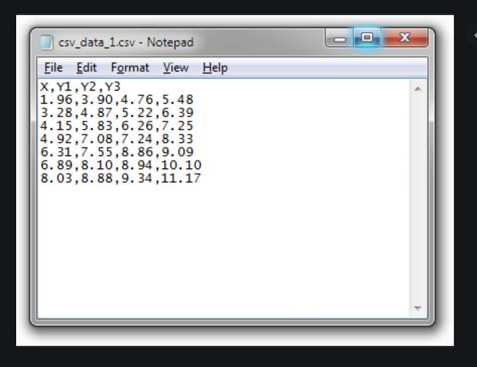

# Reading and Importing Files Using Pandas

Now that you know how to work with smaller Series and DataFrames, we're going to switch gears a bit and learn to import larger files in formats you will encounter in the wild. It will be good to learn using these types of files, to earn your own trust in your data manipulation abilities and practice real-life data analysis scenarios. 

## CSV Files

Need to import a CSV? Wait... what is a CSV? CSV is an acronym for Comma Separated Values, and may sometimes be referred to as Comma Delimited Files (Delimited is another way of saying Separated). A CSV is a plain text file that contains a list of data and are often used for exchanging data between different types of applications. For example, I can convert Excel sheets to CSV files and then import them as CSV in other applications. Considering how popular Excel is, knowing how to import CSV files is pretty handy. 

As expected, commas are used to delimit (separate) the data, but sometimes other characters, such as semicolons, can be used. 

