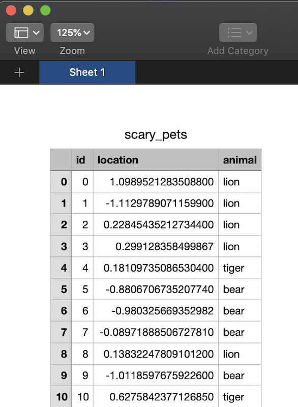
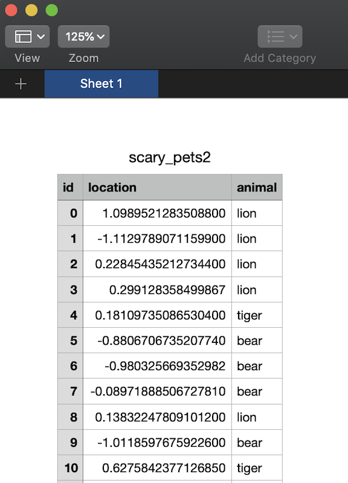

# Reading and Importing Files Using Pandas

Now that you know how to work with smaller Series and DataFrames, we're going to switch gears a bit and learn to import larger files in formats you will encounter in the wild. These file types can contain a high volume of data. It will be good to learn using these types of files, to earn your own trust in your data manipulation abilities and practice real-life data analysis scenarios to assist in data science or business analysis. 

## Tabular Data

We may have mentioned Tabular Data before, and you'll see it as you do your own research on the Internet, but let's give it a proper definition:

Tabular data is data that is structured into rows/columns, like a table. Columns and rows are identified by headers/labels that explain the data located therein.  

## CSV Files

Need to import a CSV? Wait... what is a CSV? CSV is an acronym for Comma Separated Values, and may sometimes be referred to as Comma Delimited Files (Delimited is another way of saying Separated). A CSV is a plain text file that contains a list of data and are often used for exchanging data between different types of applications. For example, I can convert Microsoft Excel files (or even Google Spreadsheets) to CSV files and then import them as CSV into other applications. Considering how popular Excel is, knowing how to import CSV files is pretty handy. 

As expected, commas are used to delimit (separate) the data, but sometimes other characters, such as semicolons or spaces, can be used. 


Let's practice with a smaller file, first. In the folder Practice Files, you should find a file called "submission.csv". If you've downloaded these files into a folder, you'll need to check where are located so you provide the proper path to tell pandas where to look for the CSV file. 

We can import 'os' to check our operating system's current working directory to determine the path we need to supply to the file. In my case, I am working in SavvyDAPython, and the file is located within the PracticeFiles subfolder. You can store your files wherever you'd like, but if you get errors telling you the file doesn't exist, it's a good idea to check your path. Going forward, I will only point to the file itself and let you figure out the proper path. :)


```
>>> import os
>>> os.getcwd()
'/Users/me/SavvyPython/SavvyDAPython'
>>> df = pd.read_csv('PracticeFiles/submission.csv')
>>> df
     Unnamed: 0  data
0             0     0
1             1     1
2             2     2
3             3     3
4             4     4
..          ...   ...
995         995   995
996         996   996
997         997   997
998         998   998
999         999   999
[1000 rows x 2 columns]
```

Side question: Can anyone guess what **cwd** stands for? 

We read a file with 1000 rows with two columns, so it's larger than we are used to. When we first create the DataFrame it will give us a preview of the first and last rows, but we can use **.head()** to get a preview of the first five rows, specifically:

```
>>> df.head()
   Unnamed: 0  data
0           0     0
1           1     1
2           2     2
3           3     3
4           4     4
>>> 
```

Pretty cool, right? 

## DataFrame to CSV

Sometimes you'll need to convert DataFrames to CSV files for exporting purposes, i.e you need to move your work to another software because of your co-worker who refuses to learn Pandas. 

Let's create a generic DataFrame, but a little bigger this time:

```
>>> our_new_df = pd.DataFrame({'id': np.arange(1000), 'location':np.random.normal(size=1000), 'animal':pd.Series(np.random.choice(['lion', 'tiger', 'bear'], size=1000, replace=True), dtype="string")})
>>> print(our_new_df)
      id  location animal
0      0  1.098952   lion
1      1 -1.112979   lion
2      2  0.228454   lion
3      3  0.299128   lion
4      4  0.181097  tiger
..   ...       ...    ...
995  995  0.049029   bear
996  996  0.188222   bear
997  997  0.473430   lion
998  998  0.908793   lion
999  999 -0.635300   bear

[1000 rows x 3 columns]
>>> 
```

It's simple to write this DataFrame to a CSV. There is a built-in method **DataFrame.to_csv()** you can use, supplying a name for the file as follows:

```
>>> our_new_df.to_csv('scary_pets.csv')
```

The file will get written to your Current Working Directory (Remember, that's what the **cwd** abbreviation is for). You can always supply the path with the **path_or_buf** parameter, if you'd like to save it somewhere else. Make sure the pathway exists or you'll get an error!


```
>>> our_new_df.to_csv(path_or_buf='/home/files_for_coworker_who_will_not_learn_pandas/scary_pets.csv')
```

Let's open our new CSV file in a text editor. 

(Mine opened in Numbers because I'm using a Mac... Yours may look different.)



By default, **to_csv()** assigns an index, but we often won't want it. We can get around it by passing **index=false**. 


```
>>> our_new_df.to_csv('scary_pets2.csv', index=False)
```

Let's open our 2nd CSV to make a comparison:



As you can see, the index column was not created. 

There are more parameters for **to_csv()** and can be found [here](https://pandas.pydata.org/pandas-docs/stable/reference/api/pandas.DataFrame.to_csv.html). Feel free to play around. 

Just for fun/practice... Convert our scary pets CSV to a DataFrame! 
Bonus: Try passing different parameters from the **read_csv()** documentation found [here](https://pandas.pydata.org/pandas-docs/stable/reference/api/pandas.read_csv.html#pandas.read_csv)


