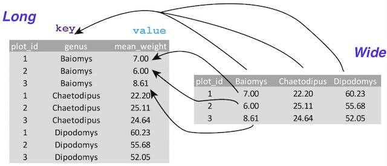

# Data Wrangling


**Data Wrangling**: taking data from its original state and changing it, or manipulating it, so it is in a usable format and ready for analysis. 

We've learned a lot over the last couple of weeks -- Topics which fall under the umbrella of data selection and inspection: How to work with NumPy, Pandas (Series and DataFrames), how to filter/slice/and select data in those objects, how to bring in data from outside sources and describe it with basic summary statistics...

Recall the first night of class, when we introduced the steps of Data Analysis. We're now ready to learn the ins and outs of Data Wrangling (Go back to [Week 1, Class 1](../Week1/Class1.md#data-wrangling) to get a review). We will often get data that is not ready for analysis, so it is up to us to sift through it, get to know it intimately, and make decisions on how to treat the data prior to performing any analysis. 

Data wrangling isn't something we'll do once with each data set (well, maybe....), but often we'll do some wrangling, do an analysis task, put it into a visualization, and then decide to go back and do more data wrangling. Data wrangling involves Data cleaning, data transformation, and data enrichment, and is not performed in any particular order. 

Remember: It's up to you to determine the types of data you need for your analysis and visualization. You're trying to tell a story and sell a story, so evidence is crucial to answering the question at hand. 

## Data Cleaning


Data cleaning is often the best starting point as it will position us with a data set having the correct data types and memorable, easy column names (for example). We will be overjoyed to have the bare minimum format needed to properly explore our data! Tasks we could do in this step could involve converting data types, renaming things, removing duplicates, solving missing data issues, reordering, sorting, and filtering. We'll be detecting and/or removing corrupt or inaccurate records. 

## Data Transformation


Data transformation is the restructuring of data to make our analysis easier. Often we'll need to swap rows vs. columns, and depending on our needs we will need a long or wide format.

So far, we've only worked with wide format. Wide format is most preferred for both database design and data analysis (And Tableau, as you will discover later), as each column will have a singular data type and instance corresponding to one observation. Wide format makes it easier to do summary statistics and plots. 

Long format has a row for each observation of a variable. See if you can spot the difference in the below example: 



Here is one way our Sacramento real estate dataframe could appear as long form:


  ```
                  city   variable             value
0           SACRAMENTO     street      3526 HIGH ST
1           SACRAMENTO     street       51 OMAHA CT
2           SACRAMENTO     street    2796 BRANCH ST
3           SACRAMENTO     street  2805 JANETTE WAY
4           SACRAMENTO     street   6001 MCMAHON DR
...                ...        ...               ...
10830       SACRAMENTO  longitude        -121.35962
10831       SACRAMENTO  longitude        -121.45889
10832   CITRUS HEIGHTS  longitude       -121.256803
10833        ELK GROVE  longitude       -121.397424
10834  EL DORADO HILLS  longitude       -121.075915

[10835 rows x 3 columns]
>>> real.describe()
              city variable  value
count        10835    10835  10835
unique          39       11   4210
top     SACRAMENTO     type     CA
freq          4829      985    985
```
Each variable per city creates a new row. As you can see, summary statistics might either not be useful or require additional manipulation. Additionally, plotting in Pandas requires wide form, but other programs such as Seaborn can handle (very well!) plotting from long format. 

**Discussion**: When do you think "long" format might be useful? 

## Data Enrichment


Data Enrichment is enhancing, refining, and improving the quality of raw data by adding to it, in one way or another. 

We can merge new data with existing data, add new columns (perhaps by using calculations on existing data), aggregate (summarize), resample (summarize time series data at specific intervals), and bin (putting data in buckets for further analysis).

 
#### Missing Data - How do we handle it?

Recall that summary statistics excludes missing data in calculations. Pandas represents missing data with "NaN" (Not a Number), which is referred to in the field as a "**sentinel**" value that is easily detected in queries. 

```
>>> cities = pd.Series(['NYC', 'STL', np.nan, 'CHI', 'SFO'])
>>> cities
0    NYC
1    STL
2    NaN
3    CHI
4    SFO
dtype: object
>>> cities.isnull()
0    False
1    False
2     True
3    False
4    False
dtype: bool
>>> 
```
In pandas, we refer to missing data as "**NA**" (not available), which may imply the data does not exist or was not observed. Cleaning up data involves doing analysis on the missing data in order to identify collection problems or biases caused by missing data. 

Python uses the "**None**" value, and is also treated as NA in object arrays: 

```
>>> cities.isnull()
0    False
1    False
2     True
3    False
4    False
dtype: bool
>>> cities[4] = None
>>> cities
0     NYC
1     STL
2     NaN
3     CHI
4    None
dtype: object
>>> cities.isnull()
0    False
1    False
2     True
3    False
4     True
dtype: bool
>>> 
```

We know from previous lessons (and from above) the **isnull()** method returns boolean values indicative of missing or NA values. The method **notnull()** does the opposite, as you may have guessed:

```
>>> cities.notnull()
0     True
1     True
2    False
3     True
4    False
dtype: bool
>>> 
```


 
